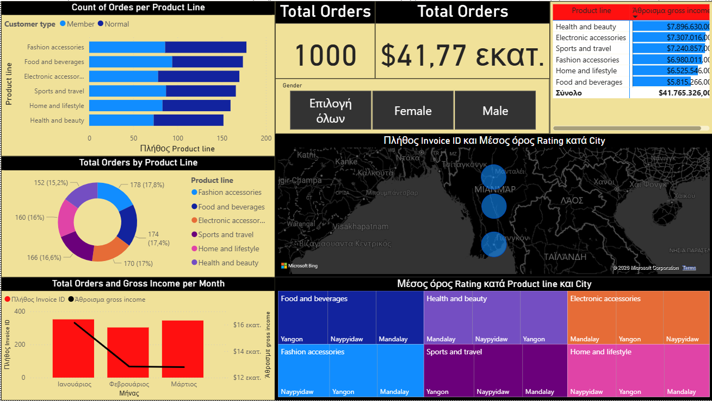
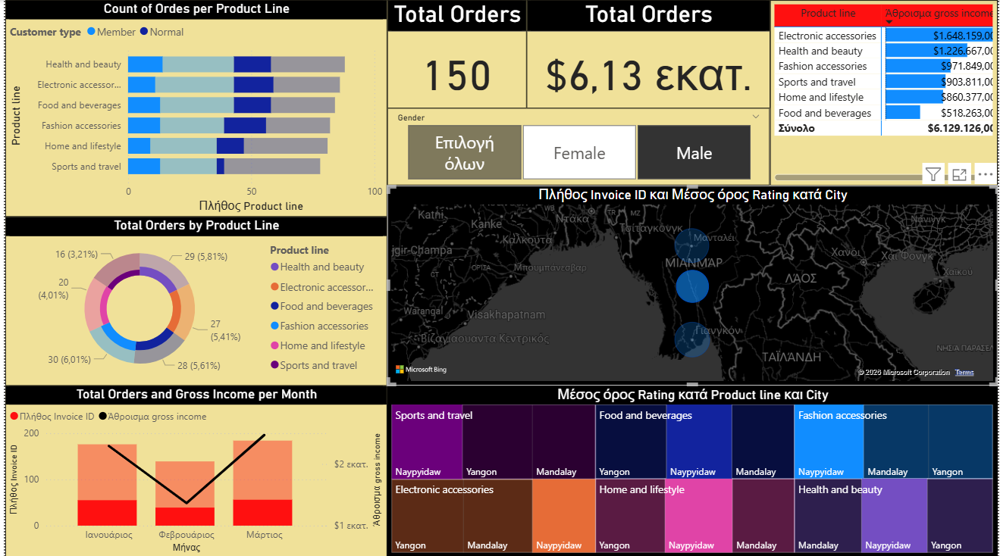
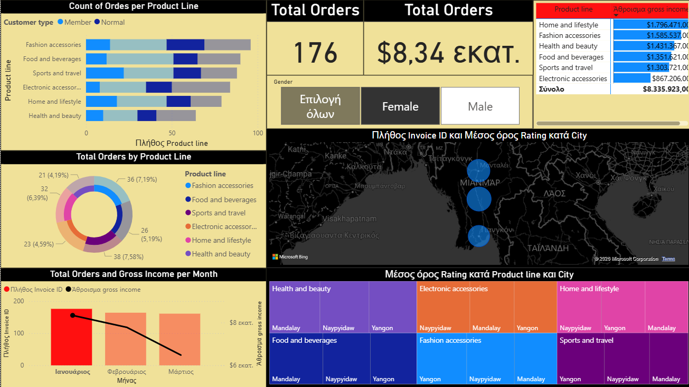

# Supermarket Sales Dashboard | Power BI

Interactive Power BI dashboard for analyzing supermarket sales, product performance, customer segments, and revenue trends.

## Overview
This Power BI project explores supermarket sales data through interactive visualizations designed to highlight product line performance, customer segmentation, geographic trends, and monthly gross income patterns.

## Project Objective
The objective of this dashboard is to transform raw sales data into a clear business intelligence report that helps identify:
- top-performing product lines
- customer purchasing patterns
- sales distribution across cities
- gross income trends over time

## Tools Used
- Power BI
- Power Query
- DAX
- Data Visualization

## Dataset
This project was created as part of a Power BI training project using a sample dataset for educational and portfolio purposes.

## Dashboard Highlights
- KPI cards for total orders and gross income
- Product line performance analysis
- Customer segmentation by type and gender
- City-level sales and rating visualization
- Monthly order and gross income trend analysis
- Interactive filtered views

## Dashboard Preview

### Overview

### Female Filter View

### Male Filter View

## Files Included
- `Supermarket-Sales-Dashboard.pbix` – Power BI dashboard file
- `supermarket-sales-overview.png` – main dashboard preview
- `supermarket-sales-female-filter-view.png` – filtered dashboard view
- `supermarket-sales-male-filter-view.png` – filtered dashboard view

## Notes
This project is presented as part of my data analytics / business intelligence portfolio.
